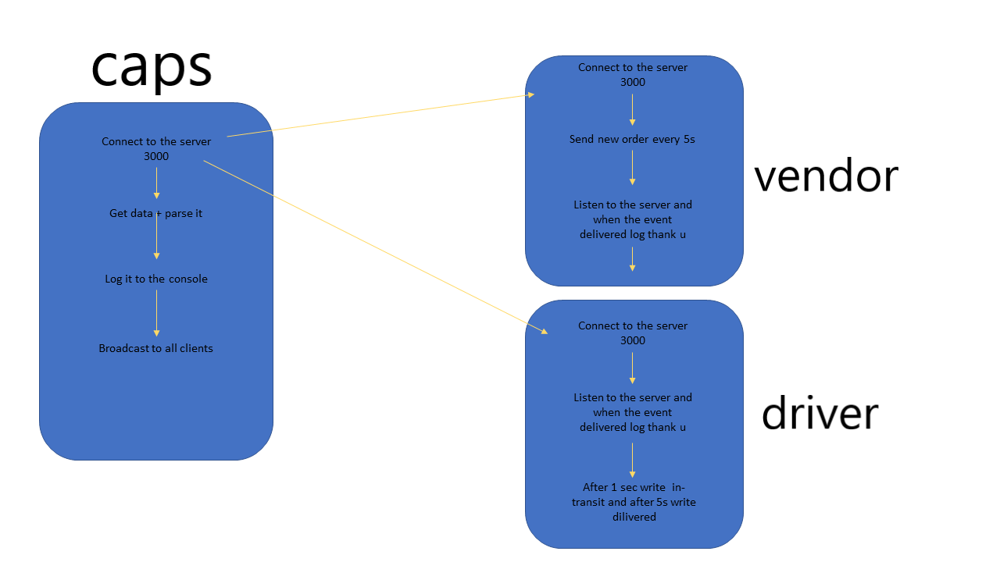

# LAB - 18
<!-- ## Project: Project Name Here -->
## Socket.io

### Author: Mohammad Samara

### Links and Resources

* [submission PR](https://github.com/mohammad-samara/caps/pull/3)
<!-- - [back-end server url](http://xyz.com) (when applicable) -->
<!-- * [front-end application]()  -->

### Documentation

* [jsdoc-index](out/caps/1.0.0/index.html)
* [jsdoc-caps](out/caps/1.0.0/caps.js.html)
* [jsdoc-global](out/caps/1.0.0/global.html)
* [jsdoc-driver](out/caps/1.0.0/driver.js.html)

<!-- * [swagger]()  -->

### Setup

#### `.env` requirements

* PORT=3000
* storeName=SamaraStore
* HOST = localhost

### Modules

#### Events modules

* `./event.js`
* `./caps.js`
* `./driver.js`
* `./vendor.js`

#### Socket.io Modules (they require npm i before working)

* `./driver/driver.js`
* `./CAPS/caps.js`
* `./vendor/vendor.js`

#### How to initialize/run your application

* `npm init -y`
<!-- * use git,postman or sawgger to use crud methods. -->

#### Tests

* Unit Tests: `npm test`
* Lint Tests: `npm run lint`

<!-- Incomplete Tests: -->

#### UML

