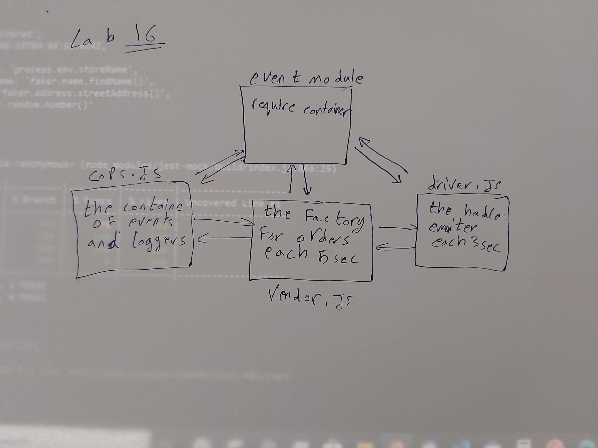

# LAB - 16
<!-- ## Project: Project Name Here -->
## Event Driven Applications

### Author: Mohammad Samara

### Links and Resources

* [submission PR](https://github.com/mohammad-samara/caps/pull/1)
<!-- - [back-end server url](http://xyz.com) (when applicable) -->
<!-- * [front-end application]()  -->

### Documentation
<!-- * [jsdoc]() -->
<!-- * [swagger]()  -->

### Modules

#### `events.js`

This is to require the event and use it in the other files.

### Setup

#### `.env` requirements

PORT=3030 // not used yet
storeName=SamaraStore

#### How to initialize/run your application

* `npm init -y`
* use git,postman or sawgger to use crud methods.

#### How to use your library (where applicable)
<!-- * use const lib=require('lib') -->
const basic = require('../events');

#### Tests

* Unit Tests: `npm test`
* Lint Tests: `npm run lint`

<!-- Incomplete Tests: -->

#### UML

